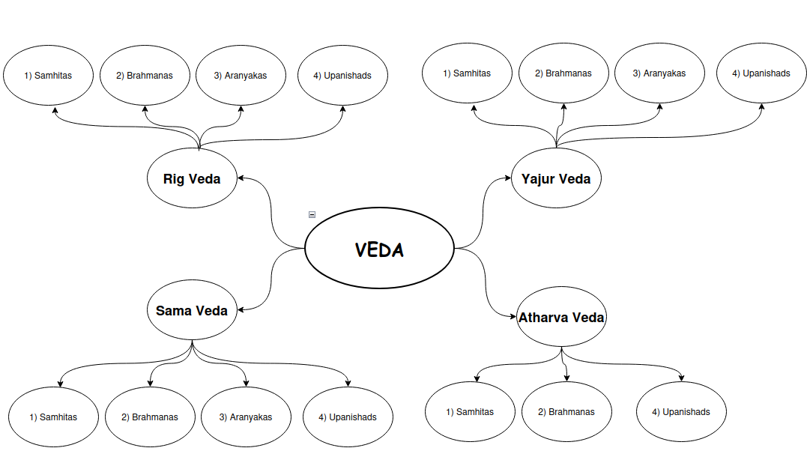

# Basics of VEDA

## Summary
Unlike most religious texts, the Vedas do not have a single "author." In the Hindu tradition, they are considered Apaurusheya, meaning "not of human origin." They are believed to be eternal truths "heard" by ancient seers (Rishis) in deep states of meditation.
Historically, the Vedas were composed and transmitted orally for centuries before being committed to writing. The sage Vyasa is traditionally credited not with writing them, but with compiling and organizing the vast body of inherited knowledge into the four distinct Vedas we know today.

## The Timeline: When were they written?
The concept of a "century" is difficult to apply to the Vedas because they existed as an oral tradition long before they were manuscripts.
1. **The Composition Period** (c. 1500 BCE – 500 BCE)
Most historians and philologists agree on the "Vedic Period," during which the hymns were composed
* **Rig Veda (The Oldest):** Roughly 1500 BCE to 1200 BCE
* **Later Vedas (Sama, Yajur, Atharva):** Roughly 1200 BCE to 900 BCE
* **Upanishads:** Primarily 800 BCE to 500 BCE.
3. **The Writing Period**
The Vedas were not actually written down until much later. The oldest surviving physical manuscripts date only to the 11th century CE (around 1000-1100 AD). This is because the Brahmins believed that the power of the Veda lay in the exact sound and vibration, which could only be preserved through a rigorous oral tradition passed from teacher to student.

## Purpose of the Vedas
The Vedas serve as the blueprint for "Dharma" (Righteous Living) and "Satya" (Truth). Their purpose shifts as one moves through the layers
* **Social & Cosmic Harmony:** Through the Samhitas and Brahmanas, the purpose is to maintain the balance of the universe (Rta) through prayer and ritual.
* **Ethical Foundation:** To provide a code of conduct for the four stages of human life
* **Self-Realization:** Through the Upanishads, the purpose is to move the human consciousness from the "finite" (body/ego) to the "infinite" (Brahman).

# The Vedas (The Root)
The word Veda comes from the Sanskrit root vid, meaning "to know." These are the oldest scriptures of Hinduism, considered Shruti (that which is heard/revealed). There are four Vedas:
+2
1. **Rig Veda:** Hymns to nature deities (Agni, Indra, Varuna).
2. **Sama Veda:** The melodies and chants (musical versions of Rig Veda).
3. **Yajur Veda:** Ritual instructions and mantras for sacrifices.
4. **Atharva Veda:** Spells, charms, and daily life procedures.

## Layers of Vedas
Each Veda is generally divided into four layers: The layers reflect the stages of life (Ashramas) in ancient India:
1. **Samhitas:** Used by students (Brahmachari) for chanting.
2. **Brahmanas:** Used by householders (Grihastha) for performing family rituals.
3. **Aranyakas:** Used by retirees (Vanaprastha) who lived in the forest to meditate on the internal meaning of rituals.
4. **Upanishads:** Used by seekers and monks (Sannyasi) to reach the ultimate truth.

---

| Veda | Samhita (Hymns) | Brahmana (Rituals) | Aranyaka (Meditation) | Upanishad (Philosophy) |
|------|------------------|--------------------|-----------------------|------------------------|
| Rig Veda | Yes | Yes | Yes | Yes |
| Sama Veda | Yes | Yes | Yes | Yes |
| Yajur Veda | Yes | Yes | Yes | Yes |
| Atharva Veda | Yes | Yes | None Extant | Yes |

---

## Summary of the 4 Mahavakyas for each Veda
To give you the full context, here is how "Aham Brahmasmi" fits with the other three Great Sayings from the other Vedas:

| Veda | Mahavakya (Sanskrit) | English Translation | Meaning |
|------|-----------------------|--------------------|---------|
| Rig Veda | Prajnanam Brahma | "Consciousness is Brahman" | Defines the nature of God. |
| Sama Veda | Tat Tvam Asi | "That Thou Art" | The teacher tells the student: "You are that." |
| Yajur Veda | Aham Brahmasmi | "I am Brahman" | The student realizes: "I am that." |
| Atharva Veda | Ayam Atma Brahma | "This Self is Brahman" | The final internal conclusion. |

---

*If you’ve learned something so far and would like to continue, click Next to move on to the next topic.*

---

[**Next... Upanishads**](https://github.com/RameshBalasubramanian/Veda/blob/main/Upanishads.md)

---

*Want to clarify some common questions?*

---

| FAQ                                           | Link                                                                                                         |
|-----------------------------------------------|-------------------------------------------------------------------------------------------------------------|
| Does Vedas specify how to celebrate Hindu festivals? | [Link](https://github.com/RameshBalasubramanian/Veda/blob/main/Misc/DoesVedasSpecifyHowToCelebrateHinduFestivals.md) |
| Why Vedas are not Hindu Holy Scripture?       | [Link](https://github.com/RameshBalasubramanian/Veda/blob/main/Misc/WhyVedasAreNotHinduHolyScripture.md)    |

