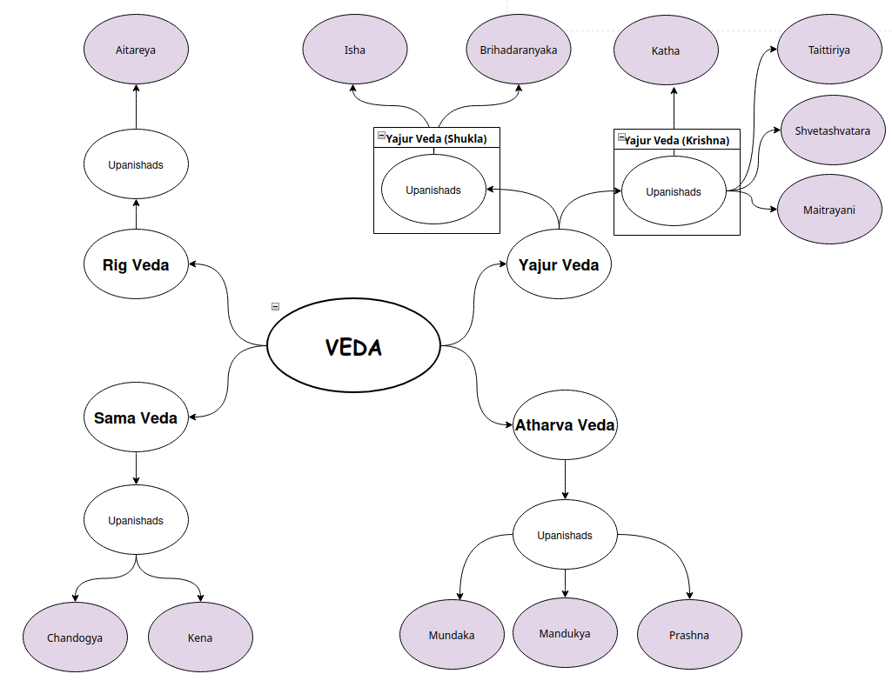

# The Upanishads (The Fruit)
The word Upanishad breaks down to Upa (near), Ni (down), and Shad (sit)—literally "sitting down near" a teacher to receive secret, spiritual instructions.
While the earlier parts of the Vedas focus on **outer actions** (rituals and sacrifices to get blessings), the Upanishads focus on **inner realization**. They ask the big "Why" questions:
* **Who am I?**
* **What happens after death?**
* **What is the ultimate reality (Brahman)?**
      
While there are traditionally **108 Upanishads** mentioned in the Muktika Canon, scholars and spiritual teachers focus primarily on the **11 Principal Upanishads** (Mukhya Upanishads). These are the ones that have been commented upon by major philosophers like Adi Shankara.
Below is the classification of these principal Upanishads according to the four Vedas.

## 1. Rig Veda
The Rig Veda is the oldest Veda, and its Upanishads focus heavily on the nature of consciousness and the observer.
* **Aitareya Upanishad:** Explores the creation of the universe and the three births of the soul.

## 2. Sama Veda
The Sama Veda is the Veda of melodies. Its Upanishads are known for their beautiful, song-like prose and deep inquiries into the nature of "Om."
* **Chandogya Upanishad:** One of the oldest and largest; contains the famous phrase Tat Tvam Asi (That Thou Art).
* **Kena Upanishad:** Investigates "by whom" (Kena) the mind and senses are directed to their objects.

## 3. Yajur Veda
As we discussed earlier, this Veda is split into two branches: the "White" (Shukla) and "Black" (Krishna).
### Shukla Yajur Veda
* **Isha Upanishad:** Focuses on seeing the divine in everything and balancing action with meditation.
* **Brihadaranyaka Upanishad:** A massive text exploring the infinite nature of the Self (Brahman).
### Krishna Yajur Veda
* **Katha Upanishad:** The story of Nachiketa and his dialogue with the God of Death.
* **Taittiriya Upanishad:** Explains the five sheaths (Koshas) of the human personality.
* **Shvetashvatara Upanishad:** Blends philosophy with devotion (Bhakti) and Yoga.
* **Maitrayani Upanishad:** Focuses on the "Pure Witness" and the three qualities of nature (Gunas).

## 4. Atharva Veda
The Atharva Veda's Upanishads are often highly philosophical and deal with the nature of the syllable "Om" and the states of consciousness.
* **Mundaka Upanishad:** Defines the difference between "Higher Knowledge" (Spiritual) and "Lower Knowledge" (Intellectual).
* **Mandukya Upanishad:** The shortest Upanishad; it explains the four states of consciousness (Waking, Dreaming, Deep Sleep, and the Fourth state, Turiya).
* **Prashna Upanishad:** Formatted as six questions asked by students to a sage regarding the origins of life and Prana.

## Summary Table: The Principal Upanishads
| Veda | Upanishads |
|------|------------|
| Rig Veda | Aitareya |
| Sama Veda | Chandogya, Kena |
| Yajur Veda (Shukla) | Isha, Brihadaranyaka |
| Yajur Veda (Krishna) | Katha, Taittiriya, Shvetashvatara, Maitrayani |
| Atharva Veda | Mundaka, Mandukya, Prashna |

---

# A Note on the 108 Upanishads
Beyond these 11, there are 97 others that are categorized based on their specific focus:
* **Sannyasa Upanishads:** Focus on monkhood and renunciation.
* **Yoga Upanishads:** Focus on Hatha Yoga, Kundalini, and meditation techniques.
* **Devotional Upanishads:** Dedicated to specific deities like Vishnu, Shiva, or Devi.

---

*If you’ve learned something so far and would like to continue, click Next to move on to the next topic.*

---

[**Next... Yejur Veda**](https://github.com/RameshBalasubramanian/Veda/blob/main/YejurVeda/Yejur.md))

---

*Want to clarify some common questions?*

---

| FAQ                                           | Link                                                                                                         |
|-----------------------------------------------|-------------------------------------------------------------------------------------------------------------|
| Does Vedas specify how to celebrate Hindu festivals? | [Link](https://github.com/RameshBalasubramanian/Veda/blob/main/Misc/DoesVedasSpecifyHowToCelebrateHinduFestivals.md) |
| Why Vedas are not Hindu Holy Scripture?       | [Link](https://github.com/RameshBalasubramanian/Veda/blob/main/Misc/WhyVedasAreNotHinduHolyScripture.md)    |

